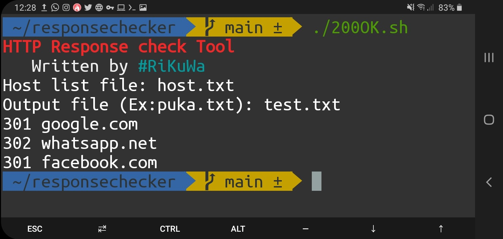

 <h1 align="center"><u>Response Checker Tool</u></h3>
 
 
 <a href="https://github.com/akilaid/responsechecker/">
    
  </a>
 
## About The Project

* This tool can check http response recursively using list of domains.
* Also this tool is able to save output to a .txt file.
 
## Table of Contents

* [Prerequisites](#prerequisites)
* [Installation](#installation)
* [Usage](#usage)

### Prerequisites

Install curl if you don't have curl and git.

* Using apt-get
```sh
apt-get install curl -y
apt-get install git -y
```
* for termux users(Android)
```sh
pkg install curl
pkg install git
```

### Installation

1. Clone the repo using git clone
```sh
git clone https://github.com/akilaid/responsechecker.git
```
2. Change directory to repo
```sh
cd responsechecker
```
3. Change permission of `200OK.sh`
```sh
chmod +x 200OK.sh
```

## Usage

1. Run the script
```sh
./200OK.sh
```
2. Host list file: name of your host list file
3. Output file: name for output file (It will be automatically created)

## Then what ?

* Results will print verbosely  
* Also it will be saved in the output file.


[product-screenshot]: images/termux.jpg
